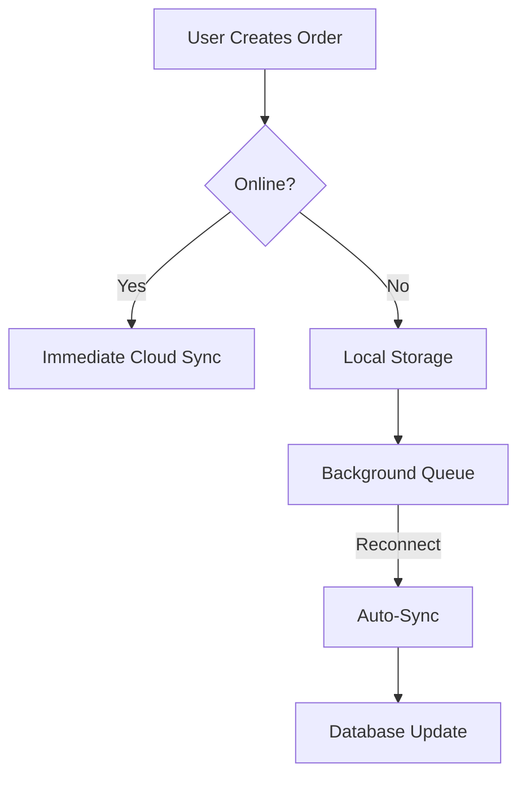
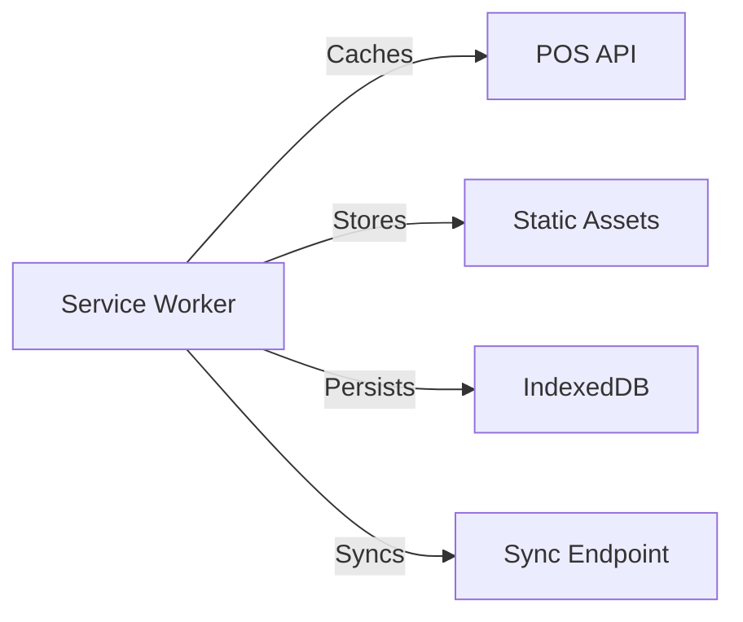

# TomatoPHP Filament POS with Barcode Integration & Offline Capabilities

[](https://www.php.net/)
[](https://laravel.com/)
[](https://filamentphp.com/)
[](https://nodejs.org/)
[](https://www.mysql.com/)
[](LICENSE)

*A modern, hybrid Point-of-Sale (POS) system built with Laravel, Filament PHP, and TomatoPHP components, featuring barcode scanning, printing capabilities, offline functionality, and robust reporting.*


---

## Overview

TomatoPHP Filament POS is a cutting-edge Point-of-Sale (POS) system designed for businesses that require both online and offline functionality. Built on Laravel and Filament PHP, this system integrates advanced features such as real-time barcode scanning, bulk barcode generation, inventory management, and intelligent synchronization for offline operations.

Whether you're running a retail store, restaurant, or any other business requiring a POS system, TomatoPHP Filament POS provides a seamless experience with its modern interface, robust backend, and offline-first architecture.

---

## Key Features

### 🛒 **Enhanced POS Interface**
- **Real-time Cart Management**
  - Add products via barcode scanning, manual search, or product grid.
  - Modify quantities with intuitive +/- buttons.
  - Apply discounts and VAT calculations dynamically.
- **Dual-Mode Operation**
  - **Online Mode**: Real-time cloud sync for seamless transactions.
  - **Offline Mode**: Local storage with automatic recovery and conflict resolution.
- **Unified Cart Management** across connectivity states.
- **Barcode Scanning Integration** powered by QuaggaJS.
- **Intelligent Totals Calculation**: Subtotal, VAT, and discounts are calculated automatically.

### 📉 **Inventory Management**
- **Product CRUD Operations**: Easily manage products with create, read, update, and delete functionality.
- **Barcode Generation & Printing**: Generate and print barcodes in bulk with customizable templates.
- **Stock Tracking**: Monitor stock levels and receive alerts for low inventory.
- **Category Management**: Organize products into categories for better organization.

### 📶 **PWA Offline Sync Architecture**


### 🖨️ **Barcode System**
- **Multi-format Support**: Code 128, EAN, UPC.
- **Thermal Printer Optimized Templates**: Print barcodes directly to thermal printers.
- **Bulk Generation API Endpoint**: Generate barcodes in bulk programmatically.

### 🔄 **Offline Synchronization**
- **Order Queuing with Conflict Resolution**: Automatically resolve conflicts when reconnecting to the server.
- **Service Worker Caching Strategy**:


### 📊 **Reporting**
- **Sales Reports**: Analyze sales performance over time.
- **Inventory Reports**: Track stock levels and product movement.
- **Customer Transaction History**: View detailed transaction records for each customer.

### 🖨️ **Print System**
- **Bulk Product Barcode Printing**: Print multiple barcodes at once.
- **Customizable Label Layouts**: Adjust label settings such as:
  - Labels per row configuration (2-4).
  - Toggle display of product name, price, or barcode number.
  - Automatic page numbering.
- **Print Preview**: Preview your labels before printing.

---

## Technology Stack

### **Core Components**
- **Backend**:
  - `tomataophp/filament-pos` (Base POS System)
  - `tomataophp/filament-pwa` (Offline Capabilities)
  - Laravel 11 (API Backend)
  - Filament PHP 3.x (Admin Interface)
  - Livewire (Realtime UI)
  - Eloquent ORM (Database Management)

- **Frontend**:
  - QuaggaJS (Barcode Scanning)
  - Workbox (Service Worker Management)
  - LocalForage (Offline Storage)
  - Tailwind CSS (Styling)
  - Alpine.js (Interactivity)

- **Database**:
  - MySQL 5.7+ or MariaDB 10.3+

- **Other Tools**:
  - Picqer PHP Barcode Generator (Barcode Generation)
  - WebPack (Asset Bundling)

---

## Installation

### **Requirements**
- PHP 8.1+ with PDO SQLite
- Composer 2.5+
- Node.js 16+ with WebPack
- MySQL 5.7+ or MariaDB 10.3+
- Webcam (for barcode scanning)

### **Setup Process**
1. **Clone Repository**:
   ```bash
   git clone https://gitlab.objects.ws/laravel/engy-pos.git
   cd engy-pos
   ```

2. **Install Dependencies**:
   ```bash
   composer install --optimize-autoloader
   npm install && npm run dev
   ```

3. **Configure Environment**:
   ```bash
   cp .env.example .env
   php artisan key:generate
   ```

4. **Enable PWA Features in `.env`**:
   ```env
   FILAMENT_PWA_ENABLED=true
   OFFLINE_STORAGE_DRIVER=indexeddb
   SYNC_RETRY_LIMIT=5
   ```

5. **Database Setup**:
   ```bash
   php artisan migrate --seed
   ```

6. **Start Development Server**:
   ```bash
   php artisan serve
   ```

---

## Usage

### **Offline Mode Operation**
1. **Initial Setup**:
   - The system auto-caches required assets on the first load.
   - Service worker registration is verified in the browser console.

2. **Creating Offline Orders**:
   - Add products normally via barcode scanning, manual search, or product grid.
   - The cart persists through page reloads.
   - Checkout creates a local transaction record.

3. **Reconnection Workflow**:
   - Automatic sync occurs upon network detection.
   - Manual sync can be triggered via the admin dashboard.
   - Conflict resolution logs are maintained for reference.

### **Barcode Management**
| Action | Online Mode | Offline Mode |
|--------|-------------|--------------|
| Scan | Immediate validation | Local cache check |
| Print | Cloud template fetch | Cached templates |
| Generate | API request | Queue for later processing |

---

## Documentation

- [Filament PWA Guide](https://tomatophp.com/en/open-source/filament-pwa)
- [Barcode Reference](https://github.com/ericblade/quagga2)
- [Filament POS Guide](https://tomatophp.com/en/open-source/filament-pos)

